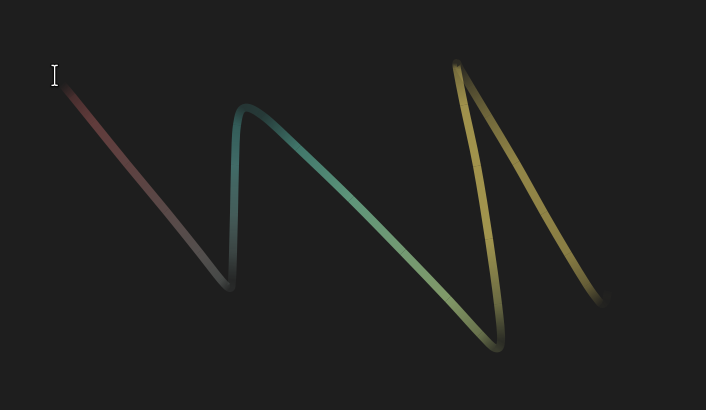

# Cursor Spark
A Gnome extension to draw the cursor spark on the screen



## Styles

Settings are organized as a style: a set of defaults plus optional overrides
that apply only while the system uses a dark style.

- The preferences dialog shows a grid of preset styles; each preview renders
  the cursor on light (top) and dark (bottom) backgrounds.
- **Customize…** opens the detailed editor: a Default/Dark toggle switches
  which state you are editing; in Dark mode each row has an icon-only revert
  button to drop the override and fall back to the default state.
- **Customize…** while a preset is active creates a new custom style derived
  from it (you can create as many as you like, each with its own card);
  while a custom style is active it edits that style in place. The editor
  has a Delete button at the bottom that removes the style and falls back
  to the first preset.
- Settings migrate automatically from older flat versions on first run.

## Development

```sh
./compile-schemas.sh                # compile the GSettings schema locally
node tests/test-style-engine.mjs    # unit tests for the shared style engine
gjs -m tests/integration-test.mjs    # integration test (schema + engine, in-memory dconf)
po/update-pot.sh                     # regenerate the translation template
po/compile-locales.sh                # compile po/*.po into locale/ (runtime translations)
./package.sh                         # build cursor-spark.zip for extensions.gnome.org
```

## Utilities

We provide a convenient script to convert standard X11 cursor files into SVG files, making it easier to use custom cursors:

```sh
# Convert an X11 cursor (e.g. left_ptr) into an SVG file
./scripts/x11_to_svg.py /usr/share/icons/Adwaita/cursors/left_ptr cursor.svg
```