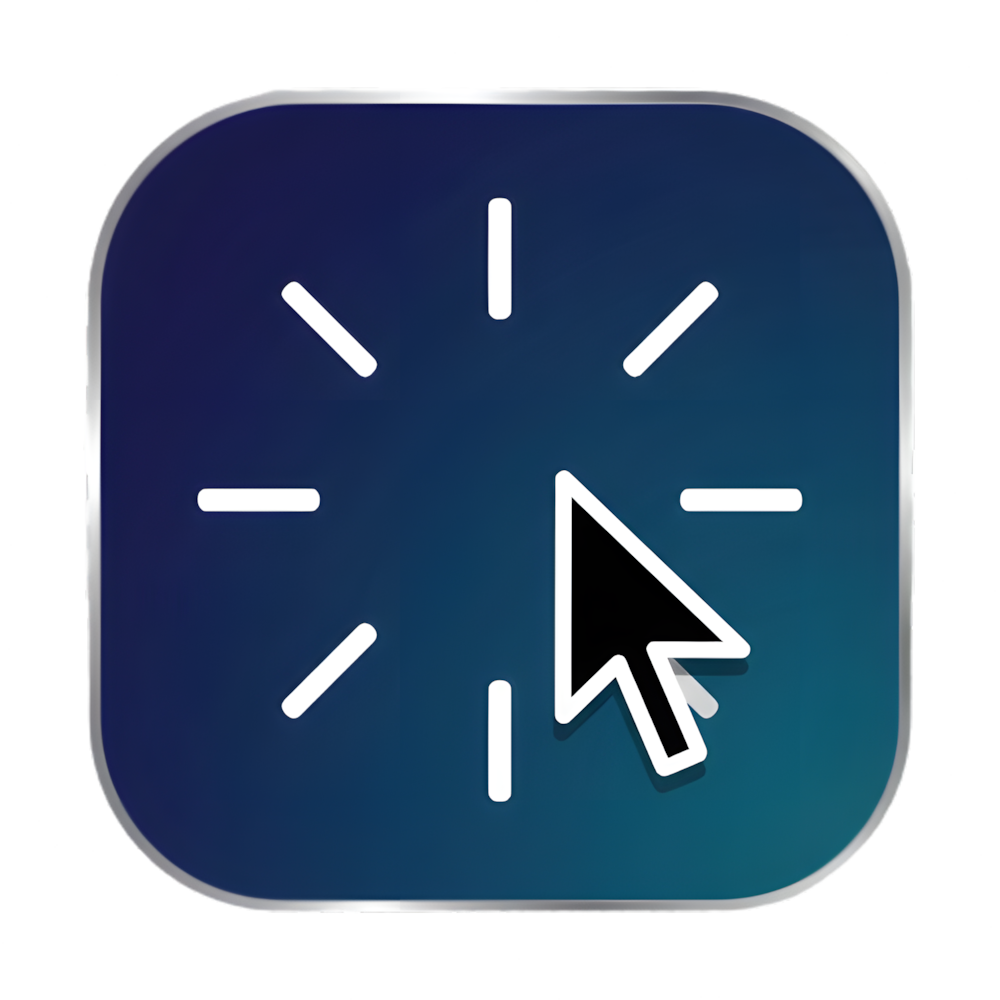

<div align="center">
  
  <h1>Smooth Cursor</h1>
  <p>A buttery smooth, physics-based cursor for GNOME Shell.</p>
</div>

---

We spend 8 hours a day staring at a pointer. It's time it felt alive. 

Every flick, drag, and click is powered by realistic physics—making your desktop feel incredibly satisfying and fluid. It's built for aesthetic screen recordings, but perfectly tuned for daily use.

## features

- **Physics-Based Movement:** The cursor drags, rotates, and settles using realistic spring physics.
- **Click Sparks & Bounce:** Since Wayland prevents extensions from dynamically reading cursor shapes (like the I-beam text selector), the cursor physically shrinks and bounces when you click to maintain a responsive feel. You can also enable aesthetic click sparks.
- **Custom Cursors:** Replace the default pointer with any custom SVG or PNG file.
- **Fully Configurable:** Every physics variable (damping, stiffness, mass, rotation sensitivity) is exposed in the extension preferences.
- **Cross-Platform:** Runs flawlessly on both Wayland and X11.

## supported versions

Smooth Cursor is built for and compatible with GNOME Shell versions: **47, 48, 49, 50, and 51**.

## installation

> **Note:** This extension is not yet available on the official GNOME Extensions website. You must install it locally using the instructions below.

### quick install (terminal)

The easiest way to install is by running these commands in your terminal:

```sh
git clone https://github.com/moksh/smooth-cursor.git
cd smooth-cursor
mkdir -p ~/.local/share/gnome-shell/extensions/smooth-cursor@m0ksh.github.io
cp -r . ~/.local/share/gnome-shell/extensions/smooth-cursor@m0ksh.github.io
```

### manual install

1. Clone or download this repository.
2. Open your file manager and navigate to `~/.local/share/gnome-shell/extensions/` (press `Ctrl` + `H` to see hidden folders).
3. Paste the downloaded folder there and rename it exactly to `smooth-cursor@m0ksh.github.io`.

### restart gnome shell

After installation, you must restart GNOME Shell to see the extension in your Extension Manager:
* **Wayland:** Log out of your user session and log back in.
* **X11:** Press `Alt` + `F2`, type `r`, and press `Enter`.

## configuration

Open the GNOME Extensions app (or Extension Manager), find "Smooth Cursor", and click the settings gear. From there, you can configure the spring physics, mass, bounce damping, click sparks, and rotation sensitivity to tune it exactly to your liking.

## translations & development

Want to help translate or build the extension from source? 

1. **Translations:** Add or update your language in the `po/` directory. Run `./po/update-pot.sh` to update the template, and `./po/compile-locales.sh` to test your translations locally.
2. **Packaging:** Run `./package.sh` to bundle the extension into a `.zip` file for distribution.

## license

This project is licensed under the [MIT License](LICENSE).
